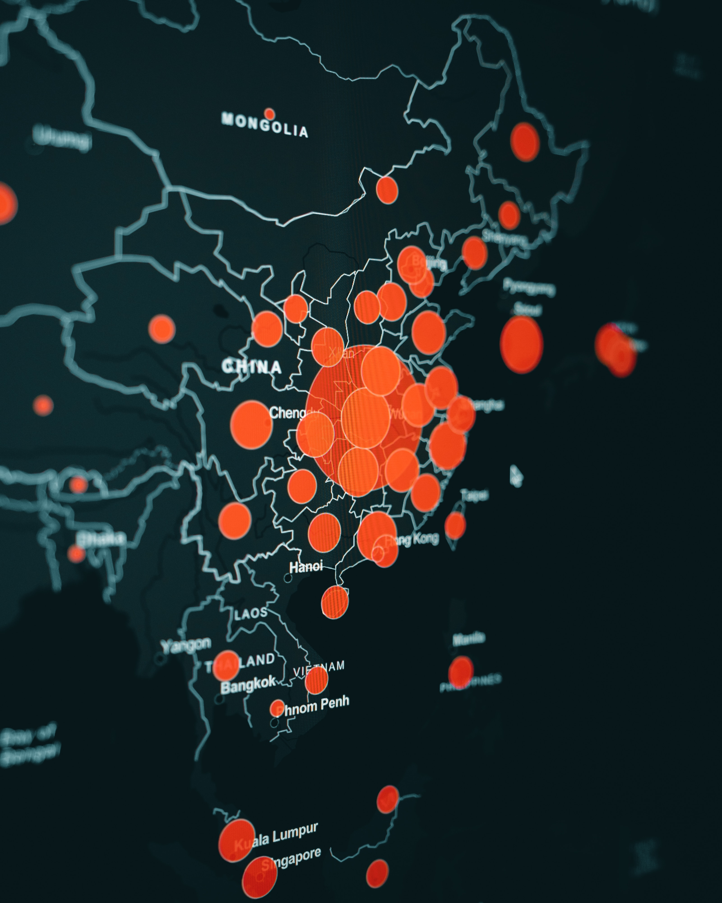
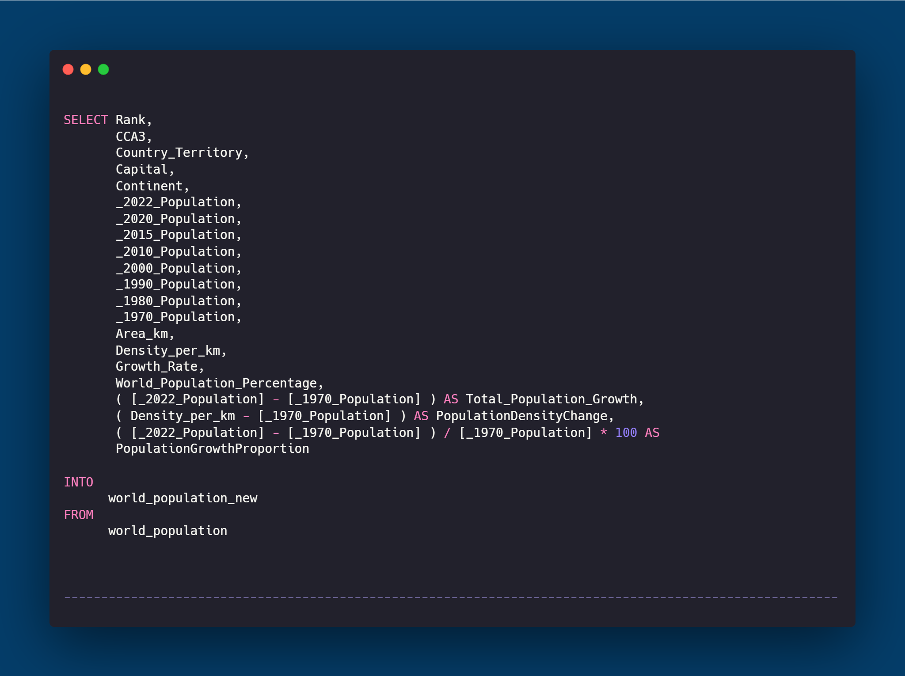
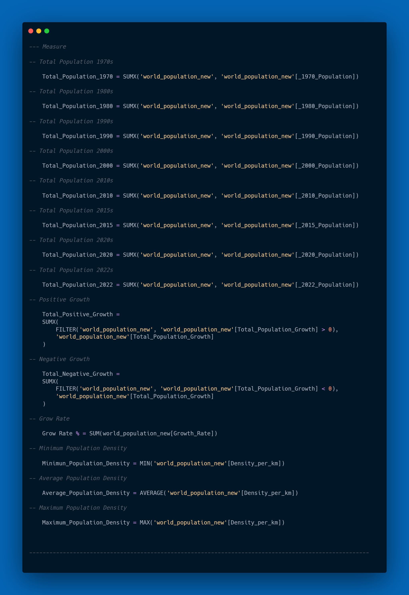

# World Population

# World Population Analysis

## 1. Introduction

This project aims to analyze and visualize world population data. The analysis includes population growth from 1970 to 2022, comparisons between the 20th and 21st centuries, rankings by population, and more.

## 2. Problem Statement

With the world's population continuing to grow, a deep understanding of growth patterns, changes in population density, and comparisons between countries can provide valuable insights. This project aims to address questions such as changes in population growth over time, as well as comparisons between countries.

## 3. Skill Demonstrated

This project includes demonstration of the following skills:
- Use of Microsoft SQL Server for data transformation.
- Use of Power BI for data analysis and visualization.
- Understanding of population changes, growth, and comparisons between countries.
- Implementation of tooltips to add additional information to visualizations.
- Use of DAX (Data Analysis Expressions) to create additional measures and calculations.
- Implementation of filtering to provide interactivity to the dashboard.
- Creation of an interactive dashboard to present information in a more dynamic and effective way.

## 4. Data Sourcing

The dataset was obtained from Kaggle and includes historical population information of each country based on various parameters such as region size, continent name, capital city name, population density, growth rate, and percentage of world population.

#### _As additional information in this project, I assume the population of 2022 is the current or updated population._

## 5. Data Transformation

The initial data is entered into Microsoft SQL Server to perform transformations such as calculating total population growth, change in population density, and proportion of population growth. The results are saved as a new dataset ready for further processing.

### SQL queries used in this project

## 6. Modeling

The initial data is entered into Microsoft SQL Server for initial processing, and subsequently, the data is processed using Data Analysis Expressions (DAX). The use of DAX allows for more complex calculations and data transformations within Power BI without requiring direct changes to the data source.
Some examples of transformations performed using DAX involve calculating total population growth from year to year, changes in population density, and proportion of population growth.

### DAX used in this project

## 7. Analyze & Visualization

At this stage, the project analyzed the data for meaningful insights and created visualizations that supported those insights. This included the creation of a multi-page dashboard that included comparisons between periods, country rankings, and world population distribution.

This Dashboard have 6 Pages ( 5 Main Pages & 1 Pages for Tooltip) :
- Growth
- Population
- 20th Century vs 21th Century Population
- 21th Century Population
- Rank by Population
- Tooltip Population

### You can interact with report here _[Novypro](https://www.novypro.com/project/world-population-)_

## 8. Conclusion & Recommendation

Based on the analysis and visualization of world population data, several key findings have been identified:

1. **Highest Population in Asia:**
   - Asia dominates as the highest population center, with countries such as China, India, and Indonesia being the main contributors to the high population.

2. **Negative Population Change:**
   - Some countries experienced negative population change, including Ukraine and Bulgaria. A decrease in population can be an indicator of demographic changes, economic or other factors affecting population growth.

3. **Extensive Population Growth:**
   - The analysis shows that almost all countries are experiencing significant population growth, with percentage increases ranging from hundreds to millions of percent. This phenomenon may reflect the complex dynamics of population growth around the world.

4. **World Population Percentage Largest in China and India:**
   - The World Population Percentage, which reflects a country's contribution to the global population, is highest in China and India. These two countries have a significant impact on the world's population distribution.
  

-----------------------------------------------------------------------------------------------------------------------------------------------------------------------------------------------------
